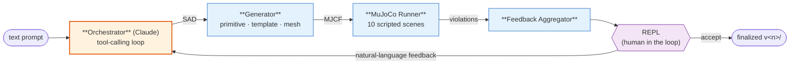

# 3D Agent

**Text prompt → physically-tested MuJoCo asset.** An LLM proposes a Structured
Asset Description (SAD), deterministic code compiles it to MJCF, MuJoCo stress-
tests it across scripted scenes, and you steer the result through a CLI
feedback loop.



Orange = LLM (semantic). Blue = deterministic code. Purple = human.

## Why this exists

Asking an LLM to emit MJCF directly is unreliable: XML is hard to diff, easy to
break, and the model has no way to know whether the joint axis it chose causes
the drawer to fly out of the cabinet at t=0.3s. 3D Agent splits the job:

- **Semantic feedback** comes from a human via a REPL (natural language).
- **Physical feedback** comes from MuJoCo as structured violations with
  diagnosis hints (slip, tip-over, interpenetration, joint range exceeded, …).
- The **SAD** is the shared language between them — a JSON document that the
  model writes, the validator checks, the generator compiles, and the human
  can read and edit. Every version is its own directory, diffable and
  rollback-able.

The design philosophy is **breadth-first, depth-shallow**: every sub-capability
is deliberately simple so the feedback loop — the actual product — works end
to end.

## Install

```bash
pip install -e .          # runtime
pip install -e ".[dev]"   # + pytest / ruff / mypy
pip install -e ".[mesh]"  # + CoACD for concave-mesh collision
```

On Windows the interpreter is invoked as `py -3`; substitute `python` on other
platforms.

## Configure

The model provider is read from the environment (never hardcoded):

| Variable | Purpose | Default |
|---|---|---|
| `THREE_D_AGENT_API_KEY` (or `ANTHROPIC_API_KEY`) | API key — **required** | — |
| `THREE_D_AGENT_BASE_URL` (or `ANTHROPIC_BASE_URL`) | Anthropic-compatible endpoint | `https://cp.compshare.cn` |
| `THREE_D_AGENT_ROOT` | Where artifacts are written | `~/.3d-agent` |

The default model is `glm-5.2`; override per command with `--model`.

## Quickstart

```bash
# Generate a new asset (interactive feedback loop)
3d-agent new --text "a small graspable block"

# At the > prompt, type natural-language feedback, or press Enter to accept.
# Add --yes to auto-accept and run non-interactively (good for scripts/CI).
3d-agent new --text "a wooden drawer with a brass handle" --yes
```

## CLI

| Command | What it does |
|---|---|
| `3d-agent new --text "…"` | Start a new session and generate the first asset. |
| `3d-agent add --session <id> --text "…"` | Add another asset to an existing session (composable). |
| `3d-agent list --session <id>` | Show every asset and version in a session. |
| `3d-agent diff --session <id> --asset <name> <v1> <v2>` | Field-level SAD diff between two versions. |
| `3d-agent rollback --session <id> --asset <name> <v>` | Restore a prior version as a new finalized one. |

Add `--yes` to `new` / `add` to skip the REPL and auto-accept.

## How it works

### 1. SAD — the contract

The LLM emits a [Structured Asset Description](src/three_d_agent/sad/schema.py):
a Pydantic-validated JSON document describing bodies, joints, materials, and
(optionally) a `compose` block that references other assets in the same
session. SAD is the only thing the model writes — XML never leaves the
deterministic layer.

### 2. Generator — SAD → MJCF

A router picks the right backend per body:

- **Primitives** — `box`, `sphere`, `cylinder`, `capsule` with mass / friction
  / material defaults.
- **Articulated templates** — 12 hand-written templates that cover common
  shapes with correct joint axes:
  `door`, `drawer`, `cabinet_with_door`, `shelf_3tier`, `table`,
  `bottle_with_screw_cap`, `hinged_lid_jar`, `valve_handle`, `lever_switch`,
  `pliers`, `scissors`, `simple_parallel_gripper`.
- **Mesh** — `primitive_kind: "mesh"` routed through a pluggable
  [`MeshGenerator`](src/three_d_agent/generator/mesh/). The default backing is
  a deterministic procedural stub (numpy only, no GPU / model weights) so the
  pipeline runs on a laptop today. A real image-to-3D model (e.g. TripoSR) can
  slot in behind the same interface. Generated `.obj` meshes are
  content-addressed in `~/.3d-agent/mesh_cache/` and reused across versions.

Generation is fully deterministic: same SAD → same MJCF, byte for byte.

### 3. Runner — scripted MuJoCo scenes

Each asset runs through deterministic scenes that emit **structured violations
with diagnosis hints**, not log strings:

| Scene | What it checks | Typical violation |
|---|---|---|
| `gravity_settle` | Does the asset come to rest under gravity? | `falls_through_floor`, `never_settles` |
| `place_on_table` | Drop onto a table; does it stay put? | `slides_off`, `tips_over` |
| `drop_from_height` | Survives a 0.5 m drop without explosion. | `explodes_on_contact` |
| `shake_test` | Resists a sinusoidal world wobble. | `falls_apart`, `joint_dislocates` |
| `nudge_robustness` | Light lateral push; should not tip. | `tips_over_easily` |
| `interpenetration_sweep` | No geom intersects another at rest. | `self_intersection` |
| `swing_hinge` | Hinges open / close within their declared range. | `range_exceeded`, `axis_wrong` |
| `pull_drawer` | Sliding joints translate the right axis the right amount. | `wrong_axis`, `pops_out` |
| `pinch_grasp` | A reference gripper can pinch the asset without it squirting away. | `slips_out`, `crushed` |
| `gripper_grasps_target` | Cross-asset: drive one asset (gripper) to grasp another. | `miss`, `drop` |

Scenes are smoke-level checks for gross failures, not high-fidelity dynamics —
see [Limits](#limits).

### 4. Feedback loop

Violations + a 4-view thumbnail (front / side / top / iso) are shown in the
REPL. You either type a natural-language correction ("the handle is too thin,
make the hinge open the other way") or press Enter to accept. The aggregated
feedback goes back into the orchestrator, which produces a new SAD version.
Every iteration is its own `v<n>/` directory.

## Multi-asset composition

A SAD may `compose` other assets in the same session, each with an
`asset_ref`, `version`, `pose`, and `role`. This is what powers the
`gripper_grasps_target` scene — one asset plays the gripper, another plays the
target, and the runner drives them together. Use `3d-agent add` to grow a
session asset by asset.

## Artifact layout

```
~/.3d-agent/sessions/<session-id>/
├── inputs.json                 # the prompt for the current asset
├── session.jsonl               # replay log: every tool call + outcome
├── feedback_history.json       # persisted human feedback (crash recovery)
└── <asset-name>/
    └── v<n>/
        ├── sad.json            # the Structured Asset Description
        ├── asset.mjcf          # the generated MuJoCo model
        ├── thumbnail.png       # 4-view (front/side/top/iso) preview
        ├── scene_results.json  # per-scene pass/fail + violations
        ├── feedback.json       # aggregated sim feedback
        └── FINALIZED           # present once the version is accepted
```

The session is the unit of recovery: kill the process mid-loop and the next
run replays `session.jsonl` + `feedback_history.json` to resume.

## Development

```bash
py -3 -m pytest -q            # full suite
py -3 -m pytest tests/unit    # fast unit layer only
```

Design docs live in [`docs/superpowers/specs/`](docs/superpowers/specs/) —
start with `2026-06-19-3d-agent-design.md` for the architecture rationale and
`2026-06-21-3d-agent-phase-2-mesh-design.md` for the mesh / composition
extension.

## Limits

- **Physics fidelity is smoke-level.** Scenes catch gross failures (slips,
  tip-overs, interpenetration, joint mis-axis); they are not a substitute for
  task-specific dynamics evaluation.
- **Text input only today.** Image and video adapters are designed for but
  not wired in.
- **CPU-only by design.** Asset generation runs on an 8 GB laptop; the
  mesh backend is a procedural stub until a CPU-friendly image-to-3D model
  is plugged in.
- **Single-body + 1–3 joints.** Full kinematic chains (robot arms) are out of
  scope.
